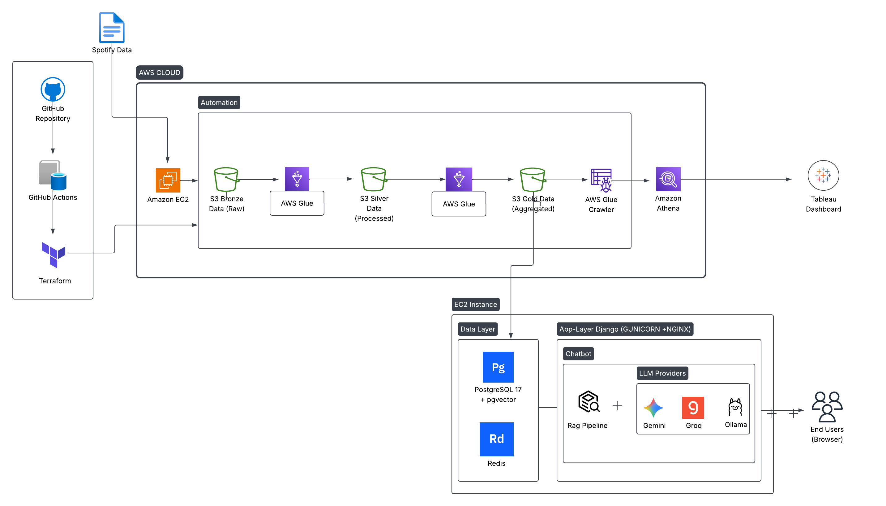

# 🎵 Global Music Intelligence Platform

A cloud-native Global Music Intelligence Platform that ingests large-scale Spotify data, processes it using an AWS Medallion Data Lake with AWS Glue and Apache Spark for ETL, delivers BI analytics through Amazon Athena and Tableau, and provides natural-language insights through a PostgreSQL/pgvector and Redis-powered RAG chatbot supporting multiple LLM providers (Gemini, Groq, Ollama), with Django serving as the web application backend.

The platform combines:
- **AWS Data Lake and Medallion Architecture**
- **Automated data ingestion**
- **AWS Glue + Apache Spark ETL**
- **Amazon Athena serverless analytics**
- **Terraform Infrastructure as Code**
- **GitHub Actions CI/CD automation**
- **PostgreSQL + pgvector and Redis**
- **Retrieval-Augmented Generation (RAG)**
- **Multiple LLM providers**
- **Web application and chatbot**
- **Tableau business intelligence dashboards**

---

# 📌 Project Overview

The **Global Music Intelligence Platform** is designed to process large-scale Spotify chart datasets containing millions of records across songs, artists, albums, countries, and record labels.

The platform follows a layered architecture:

**Data Source → Ingestion → S3 Bronze → Glue ETL → S3 Silver → Glue ETL → S3 Gold → Athena/Tableau**

In parallel, the curated data is made available to an application layer running on an **Amazon EC2 instance**, where PostgreSQL with **pgvector**, Redis, and a **RAG pipeline** support conversational analytics through a web application and chatbot.

The project therefore combines traditional **BI-driven analytics** with **AI-powered natural-language data interaction**.

---

# 🎯 Business Problem

The rapid growth of music streaming platforms produces large volumes of data across countries, songs, artists, albums, and record labels. Business stakeholders need a centralized platform to understand this information and convert it into actionable insights.

The platform addresses the following business problems:
- Cross-Country Music Consumption Analytics
- Artist Performance Analytics
- Record Label Performance Analytics
- Streaming Trend Analysis
- Market Share Analysis
- Business KPI Reporting
- Natural-Language Access to Music Data

---

# 🎯 Project Objectives

- Build a scalable cloud-native data lake on AWS.
- Implement **Medallion Architecture** using Bronze, Silver, and Gold layers.
- Automate data ingestion and ETL processing.
- Process large datasets using Apache Spark through AWS Glue.
- Create business-ready Gold datasets and KPIs.
- Enable serverless SQL analytics through Amazon Athena.
- Connect curated data to Tableau for interactive dashboards.
- Provision infrastructure using Terraform.
- Implement CI/CD automation using GitHub Actions.
- Build an AI-powered RAG layer for natural-language interaction with project data.
- Provide a web-based chatbot for end users.
- Support multiple LLM providers such as Gemini, Groq, and Ollama.

---

# 🏗️ Solution Architecture



The solution architecture integrates data engineering pipelines and AI applications:

### DevOps & Infrastructure
- **GitHub Repository**: Stores ingestion, ETL, Terraform, and web application code.
- **GitHub Actions**: Provides CI/CD workflows for validation and automated deployment.
- **Terraform**: Manages AWS infrastructure as Code (IaC) to ensure reproducible and consistent environments.

### Ingestion & Storage
- **Amazon EC2**: Runs the modular data ingestion pipeline to fetch raw Spotify data.
- **Amazon S3 (Bronze Layer)**: Serves as the landing zone storing raw, immutable source data.

### ETL & Schema Discovery
- **AWS Glue ETL**: Uses Apache Spark jobs for cleaning and transforming data from Bronze to Silver, and aggregating business metrics from Silver to Gold.
- **Amazon S3 (Silver Layer)**: Stores cleaned, standardized, and type-cast datasets.
- **Amazon S3 (Gold Layer)**: Stores curated, business-ready datasets optimized for querying.
- **AWS Glue Crawler**: Automatically scans the Gold datasets to discover schemas.
- **AWS Glue Data Catalog**: Maintains metadata schemas and acts as a central metastore.

### Serverless SQL & BI Analytics
- **Amazon Athena**: Allows serverless SQL queries to run directly against S3 Gold data.
- **Tableau Dashboard**: Visualizes global trends, market shares, and KPIs.

### Data & AI Application Layer
- **PostgreSQL 17 + pgvector**: Stores application-related metadata and handles vector similarity search.
- **Redis**: Acts as an in-memory caching layer for quick context lookup.
- **RAG Pipeline**: Retrieves relevant context to generate grounded LLM responses.
- **LLM Providers (Gemini, Groq, Ollama)**: Serves cloud-based and local LLMs.
- **Django Backend**: Serves as the core web application framework connecting the user-facing interface, RAG pipeline, PostgreSQL, and Redis.
- **Gunicorn + NGINX**: Form the deployment layer hosting the web application on EC2.
- **Chatbot & Web Interface**: Natural-language interface enabling end users to query platform data.

---

# 🏅 Medallion Architecture

## 🥉 Bronze — Raw
- Preserves raw ingested Spotify datasets in their original structure.
- Serves as the source of truth for downstream pipelines.

## 🥈 Silver — Cleaned
- Performed via AWS Glue (Apache Spark).
- Cleanses data, removes duplicates, handles null values, and maps country codes.

## 🥇 Gold — Business Ready
- Generates aggregated reporting tables.
- Creates optimized schemas for Tableau dashboards and chatbot queries.

---

# 🔄 End-to-End Data Flow

1. **Ingestion**: Raw Spotify datasets are downloaded to EC2 and uploaded to S3 Bronze.
2. **Standardization (Glue ETL)**: Data is cleaned and moved from S3 Bronze to S3 Silver.
3. **Aggregation (Glue ETL)**: Business metrics are calculated and stored in S3 Gold.
4. **Data Cataloging**: Glue Crawlers scan S3 Gold and catalog metadata in Glue Data Catalog.
5. **Business Intelligence**: Amazon Athena queries S3 Gold datasets to feed the Tableau Dashboard.
6. **Conversational Analytics**: Django backend handles user requests via a chatbot interface, leveraging a RAG pipeline (using PostgreSQL/pgvector and Redis) to retrieve context, prompting Gemini/Groq/Ollama to generate grounded natural-language responses.

---

# ⚙️ DevOps and Infrastructure Automation

### Terraform
Manages cloud infrastructure resources declaratively to guarantee consistency:
- `terraform init`
- `terraform fmt`
- `terraform validate`
- `terraform plan`
- `terraform apply`

### GitHub Actions
Automates checks and deployments upon code updates, running unit tests and applying Terraform templates.

---

# ☁️ AWS Services Used

| Service | Purpose |
|---|---|
| Amazon EC2 | Ingestion pipeline execution and application hosting |
| Amazon S3 | Data Lake storage (Bronze, Silver, Gold layers) |
| AWS Glue | Scalable Apache Spark ETL jobs |
| AWS Glue Crawler | Automatic metadata and schema discovery |
| AWS Glue Data Catalog | Central metadata registry |
| Amazon Athena | Serverless SQL queries |
| IAM | Access management and security policies |

---

# 🧠 AI & Application Technologies

| Technology | Purpose |
|---|---|
| Django | Web backend and application logic |
| Gunicorn | WSGI application server |
| NGINX | Reverse proxy and web server |
| PostgreSQL 17 | Application and metadata storage |
| pgvector | Vector storage and similarity search |
| Redis | Caching and session management |
| RAG Pipeline | Context retrieval and response generation |
| Gemini | Cloud LLM provider |
| Groq | Cloud LLM provider |
| Ollama | Local LLM execution |

---

# 💻 Technology Stack

### Data Engineering
- Python
- Apache Spark
- AWS Glue
- Amazon S3
- Amazon Athena
- AWS Glue Data Catalog

### Cloud & DevOps
- Amazon EC2
- Terraform
- GitHub
- GitHub Actions
- IAM

### Backend & Application
- Django
- Gunicorn
- NGINX
- Python

### Database & AI
- PostgreSQL 17
- pgvector
- Redis
- RAG
- Gemini
- Groq
- Ollama

### Visualization
- Tableau

---

# 📂 Dataset

**Source:** Spotify Charts Dataset — Kaggle

The dataset contains information related to:
- Artists
- Daily song charts
- Daily artist charts
- Weekly album charts
- Artwork metadata
- Countries
- Record labels
- Streaming metrics

---

# 📊 Key Business Analytics

The platform enables analytical insights across multiple dimensions:

### Global Streaming Trends
- Global streaming volume trends
- Country-wise streaming patterns
- Daily and long-term consumption patterns
- Growth and decline patterns across markets
- Identification of emerging markets

### Artist Analytics
- Artist popularity
- Artist growth
- Chart performance
- Cross-country artist performance
- Identification of emerging artists

### Record Label Analytics
- Record label market share
- Streaming contribution by label
- Top-performing record labels
- Label-level growth trends
- Competitive market analysis

### Investment Opportunity Matrix
The **Investment Opportunity Matrix** combines market performance metrics to pinpoint high-value opportunities.
- **Dimensions**: Market growth, streaming demand, artist performance, competitive landscape, market potential.
- **Classifications**: High Opportunity, Emerging Opportunity, Established Market, Low Priority.
- **Purpose**: Converts raw streaming metrics into a business framework for strategic investment decisions.

---

# 📊 Tableau Analytics Layer

Tableau connects to the analytical layer through Amazon Athena. The dashboard provides business-level analytics such as:
- Global streaming trends
- Country-wise consumption
- Artist rankings/performance
- Record-label market share
- Investment opportunity analysis
- Business KPIs

---

# 📁 Repository Structure

```text
Global-Music-Intelligence-Platform/
│
├── .github/
│   └── workflows/
│       ├── ci.yml
│       └── deploy.yml
│
├── architecture/
│   └── global-music-intelligence-platform-architecture.png
│
├── dashboard/
│   └── README.md
│
├── etl/
│   ├── final_silver_etl.py
│   └── gold_etl.py
│
├── ingestion/
│   ├── downloader.py
│   ├── extractor.py
│   ├── uploader.py
│   ├── helper.py
│   ├── logger.py
│   ├── config.py
│   ├── requirements.txt
│   └── main.py
│
├── notebooks/
│   ├── Taikhum/
│   ├── nikita/
│   ├── rafat/
│   ├── sarvesh/
│   └── shrirang/
│
├── terraform/
│
├── webapp/
│
└── README.md
```

> The exact folder structure may evolve as the application and RAG components are further integrated.

---

# 🔐 Security & Access

The platform uses AWS IAM to control access between AWS services and workloads.
Key principles include:
- Least-privilege permissions
- Controlled S3 access
- Secure service-to-service communication
- Avoiding hard-coded cloud credentials
- Separation of application and data responsibilities

---

# 🚀 Future Enhancements

- Real-time streaming ingestion using Amazon Kinesis
- Workflow orchestration using Apache Airflow
- Automated data-quality validation
- Advanced data lineage and governance
- Predictive analytics and ML models
- Automated Tableau dashboard refresh
- Advanced RAG evaluation
- RAG observability and tracing
- Fine-grained authorization for application users
- Additional LLM providers
- Production-grade containerization and deployment

---

# 👥 Contributors

This project is being developed as a cloud-native data engineering solution demonstrating modern AWS Data Lake architecture, scalable ETL pipelines, serverless analytics, and business intelligence reporting.

---

# ⭐ Project Highlights

- End-to-End AWS Data Engineering Platform
- Scalable S3 Data Lake
- Medallion Architecture
- Apache Spark ETL using AWS Glue
- Serverless SQL Analytics using Amazon Athena
- Automated ingestion pipeline
- Infrastructure as Code using Terraform
- GitHub Actions CI/CD
- PostgreSQL + pgvector vector storage
- Redis caching layer
- Retrieval-Augmented Generation
- Multi-LLM architecture
- Web Application and AI Chatbot
- Tableau Business Intelligence
- Production-inspired cloud architecture
- Combination of traditional BI and Generative AI analytics

---

# 📌 One-Line Project Summary

> **A cloud-native Global Music Intelligence Platform that ingests large-scale Spotify data, processes it using an AWS Medallion Data Lake with AWS Glue and Apache Spark for ETL, delivers BI analytics through Amazon Athena and Tableau, and provides natural-language insights through a PostgreSQL/pgvector and Redis-powered RAG chatbot supporting multiple LLM providers (Gemini, Groq, Ollama), with Django serving as the web application backend.**
